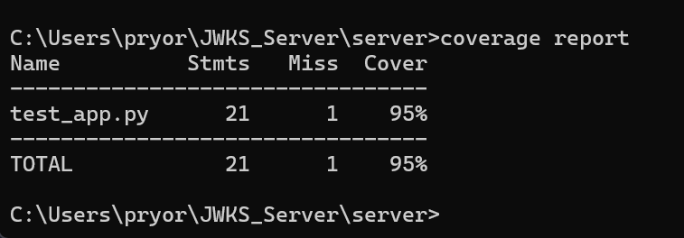

# JWKS Server with AES-Encrypted Private Key Storage

## Overview

This project was developed for my Foundations of Cybersecurity course at the University of North Texas. It is the third version of my RESTful JSON Web Key Set (JWKS) server project.

This version builds on the SQLite-backed JWKS server by adding AES encryption for private keys stored in the database. Instead of storing private keys in plaintext, the server encrypts the private key material before saving it and decrypts it only when needed by the application.

The server generates RSA key pairs, encrypts private keys at rest, stores key data in SQLite, manages key expiration, signs JSON Web Tokens, and serves valid public keys through a JWKS endpoint.

Original base version:

```text
https://github.com/AstroPryor/JWKS_SERVER
```

SQLite version:

```text
https://github.com/AstroPryor/JWKS-Server-SQL
```

## Purpose

The purpose of this project was to:

- Extend the SQLite-backed JWKS server with AES encryption
- Protect private keys while stored in the database
- Read the AES encryption key from an environment variable
- Generate RSA public/private key pairs
- Create signed JSON Web Tokens
- Serve valid public keys through a JWKS endpoint
- Handle expired keys correctly
- Practice backend security concepts using Python, Flask, JWTs, RSA keys, SQLite, and encrypted key storage

## Technologies Used

- Python
- Flask
- PyJWT
- Cryptography
- SQLite
- unittest
- coverage
- requests
- Environment variables

## Repository Structure

```text
JWKS_Server_AES_Encryption/
├── Gradebot P3.png
├── JWKS_P3_Coverage.png
├── README.md
├── app.py
├── screenshot of test suite.png
└── test_app.py
```

## File Descriptions

### `app.py`

`app.py` is the main Flask application for the AES-encrypted JWKS server. It contains the application logic for generating RSA keys, encrypting private keys, storing encrypted keys in SQLite, creating JWTs, serving public keys, and managing key expiration.

This file is responsible for:

- Starting the Flask server
- Creating or connecting to the SQLite database
- Generating RSA public/private key pairs
- Reading the AES encryption key from an environment variable
- Encrypting private keys before database storage
- Decrypting private keys when needed by the server
- Creating signed JSON Web Tokens
- Returning public keys in JWKS format
- Managing key expiration
- Handling the `/auth` endpoint
- Handling the `/.well-known/jwks.json` endpoint

### `test_app.py`

`test_app.py` contains the unit tests for this version of the project. The tests verify that the AES-encrypted JWKS server works correctly and that the required security features behave as expected.

This file is responsible for testing:

- JWKS endpoint responses
- Authentication endpoint responses
- JWT generation
- Private key encryption behavior
- Private key decryption behavior
- Database-backed key storage
- Expired key handling
- Basic server functionality
- Test coverage requirements

### `Gradebot P3.png`

`Gradebot P3.png` is a screenshot related to the project grading or submission results.

### `JWKS_P3_Coverage.png`

`JWKS_P3_Coverage.png` is a screenshot showing test coverage output for this version of the project.

### `screenshot of test suite.png`

`screenshot of test suite.png` is a screenshot showing the test suite output for the AES encryption version of the JWKS server.

## Features

This project includes the following features:

- Generates RSA public/private key pairs
- Stores key data in a SQLite database
- Encrypts private keys before storing them
- Uses AES encryption to protect private key material at rest
- Reads the encryption key from an environment variable
- Decrypts private keys only when needed by the server
- Manages key expiration
- Ensures only valid, non-expired public keys are available through the JWKS endpoint
- Creates signed JWTs through the authentication endpoint
- Tests the `/auth` endpoint
- Tests the JWKS endpoint for retrieving JSON Web Key Sets
- Uses `unittest` for automated testing
- Uses `coverage` to measure test coverage

## Endpoints

### JWKS Endpoint

```http
GET /.well-known/jwks.json
```

This endpoint returns the currently available public keys in JWKS format. These public keys can be used by clients to verify JWTs signed by the server.

Example request:

```bash
curl http://127.0.0.1:8080/.well-known/jwks.json
```

Expected behavior:

- Returns a JSON Web Key Set
- Includes valid, non-expired public keys
- Does not expose private keys
- Retrieves key information from the SQLite-backed key storage logic
- Keeps private key material encrypted at rest

### Authentication Endpoint

```http
POST /auth
```

This endpoint returns a signed JWT using one of the available RSA private keys.

Example request:

```bash
curl -X POST http://127.0.0.1:8080/auth
```

Expected behavior:

- Retrieves an available private key
- Decrypts the private key for signing
- Generates a signed JWT
- Returns the token to the client
- Supports testing of JWT signing and verification behavior

## Environment Variable Setup

This project uses an environment variable to provide the AES encryption key used to encrypt and decrypt private keys.

For this project, the environment variable is:

```text
NOT_MY_KEY
```

Example value:

```text
my_super_secret_key
```

### Set the Environment Variable on Windows Command Prompt

```cmd
set NOT_MY_KEY=my_super_secret_key
```

### Set the Environment Variable on Windows PowerShell

```powershell
$env:NOT_MY_KEY="my_super_secret_key"
```

### Set the Environment Variable on macOS/Linux

```bash
export NOT_MY_KEY=my_super_secret_key
```

Do not hard-code real encryption keys directly into the source code. For real applications, secrets should be managed using a secure secrets management system.

## How to Run

### 1. Install Python

Make sure Python 3.x is installed.

Check your Python version with:

```bash
python --version
```

or:

```bash
python3 --version
```

### 2. Clone the Repository

```bash
git clone <repository-url>
cd <repository-name>
```

Replace `<repository-url>` with the actual GitHub repository URL.

Replace `<repository-name>` with the folder name created after cloning the repository.

### 3. Create a Virtual Environment

On Windows:

```bash
python -m venv venv
venv\Scripts\activate
```

On macOS/Linux:

```bash
python3 -m venv venv
source venv/bin/activate
```

### 4. Install Dependencies

Install the required Python packages:

```bash
pip install flask pyjwt cryptography requests coverage
```

SQLite is included with Python through the built-in `sqlite3` module, so a separate SQLite Python package is usually not required.

If a `requirements.txt` file is added later, dependencies can be installed with:

```bash
pip install -r requirements.txt
```

### 5. Set the AES Encryption Key

On Windows Command Prompt:

```cmd
set NOT_MY_KEY=my_super_secret_key
```

On Windows PowerShell:

```powershell
$env:NOT_MY_KEY="my_super_secret_key"
```

On macOS/Linux:

```bash
export NOT_MY_KEY=my_super_secret_key
```

### 6. Run the Server

```bash
python app.py
```

The server runs locally at:

```text
http://127.0.0.1:8080
```

## Testing the Server Manually

### Test the JWKS Endpoint

Run:

```bash
curl http://127.0.0.1:8080/.well-known/jwks.json
```

This should return the available public keys in JWKS format.

### Test the Authentication Endpoint

Run:

```bash
curl -X POST http://127.0.0.1:8080/auth
```

This should return a signed JWT.

## Running Unit Tests

Run the unit tests with:

```bash
python -m unittest test_app.py
```

This command runs the test cases in `test_app.py` and verifies that the main parts of the server are functioning correctly.

## Running Tests with Coverage

To run the tests with coverage tracking:

```bash
coverage run -m unittest test_app.py
coverage report -m
```

This shows how much of the project code is covered by the unit tests and displays missing lines if coverage is incomplete.

## Test Output

The repository includes screenshots showing the test and grading output for this project:

```text
Gradebot P3.png
JWKS_P3_Coverage.png
screenshot of test suite.png
```

If the images do not display correctly on GitHub because of spaces in the file names, rename them to:

```text
gradebot-p3.png
jwks-p3-coverage.png
test-suite-output.png
```

Then update the image links to:

```markdown


```

Current image links:

```markdown



```


## What I Learned

Through this project, I gained hands-on experience with:

- Extending an existing security-focused backend project
- Using SQLite for local database storage
- Encrypting private keys before database storage
- Reading secrets from environment variables
- Generating RSA public/private key pairs
- Creating and signing JSON Web Tokens
- Understanding JSON Web Key Sets
- Managing key expiration
- Protecting private key material at rest
- Writing Python unit tests
- Measuring test coverage
- Connecting cryptography concepts with backend authentication design

This project helped me better understand why private keys should not be stored in plaintext and how encryption can be used to protect sensitive key material in an authentication system.

## Related Versions

This repository is the third version of the JWKS server project.

Related versions include:

- Base RESTful JWKS server with in-memory key handling
- SQLite-backed JWKS server
- AES-encrypted private key storage version
- Version with user registration, authentication logging, and rate limiting

This version specifically focuses on encrypting private keys before storing them in the SQLite database.

## Disclaimer

This project was created for educational purposes as part of a cybersecurity course. It is intended to demonstrate JWKS, JWT, RSA key handling, SQLite-backed key storage, AES encryption, key expiration, and basic REST API security concepts in a controlled local environment.

This project is not intended for production use without additional security hardening, secure secret management, stronger access control, deployment hardening, and a full review of the cryptographic implementation.
